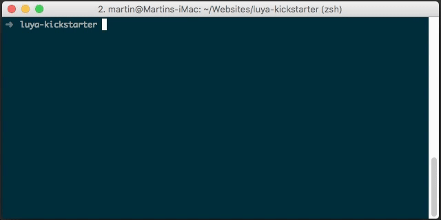
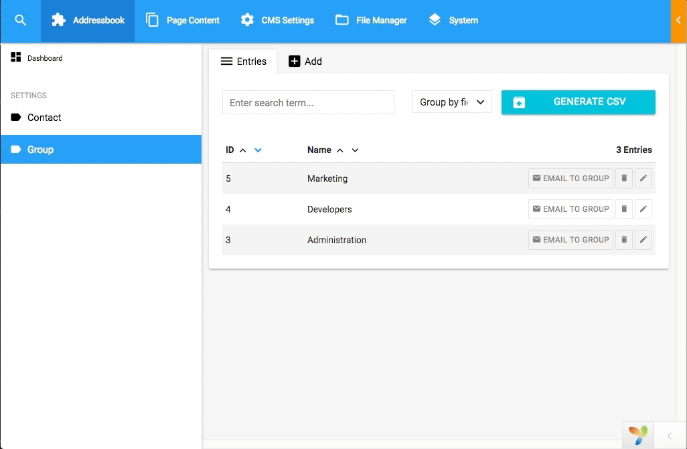

# How to create a LUYA ActiveWindow

In this lesson we're going to add a special email function to the [address book](https://github.com/luyadev/luya-module-addressbook) which we've created in the [previous lesson](https://github.com/luyadev/luya/blob/master/docs/guide/lesson-module.md). We'll extend the original CRUD view for the contact group list in the CMS with another button. This button will open a window overlay which will give us the possibility to freely add custom actions and views. In our case, we want to add the feature to send all contacts in the group list an email. 

We'll learn how to add and integrate an [ActiveWindow](https://luya.io/guide/ngrest-activewindow) to an existent LUYA module.

## Creating the ActiveWindow

As in the previous examples we'll use a LUYA code wizard to create a generic base for our ActiveWindow:

```php
./vendor/bin/luya aw/create
```
See the GIF below:



## Adding the ActiveWindow to our group model

As stated in the [ActiveWindow Documentation]() we'll have to add the button for opening the ActiveWindow view in the associated model file. As we want to send the emails for every group, we've to modifiy the `addressbook/model/Group.php` and add the function `ngRestConfig` as the declaration is missing in our case :

```php
public function ngRestActiveWindows()
{
	return [
            ['class' => \app\modules\addressbook\admin\aws\GroupEmailActiveWindow::className(), 'alias' => 'Email to group', 'icon' => 'email'],
        ];
}
```

If the function is already defined, just add the `GroupEmailActiveWindow' entry as shown above.
This includes linking to the correct class definition of the ActiveWindow, adding a text and a meaningful icon for the button.

## Configuring the mail LUYA component

The next step is to actual declare our functions, which are needed to send the emails to all members of the group. The LUYA `mail` component was created especially for handling emails. It's included in every LUYA installation and you've only configure it with your credentials (i.e. pointing to your smtp server etc.). These are the standard values which have to be changed in the kickstarter installation config file `configs/env-local.php`:

```php
'components' => [        
        /*
         * Add your smtp connection to the mail component to send mails (which is required for secure login), you can test your
         * mail component with the luya console command ./vendor/bin/luya health/mailer.
         */
        'mail' => [
            'host' => null,
            'username' => null,
            'password' => '',
            'from' => null,
            'fromName' => null,
        ]
]
```

## Adding the email function

Next, we'll define a callback function `CallbackSendMail` in our generated ActiveWindow class in `modules/addressbook/admin/aws/GroupEmailActiveWindow` which will be called by the view later. We'll define `$subject` and `$text` as input parameters which will contain the email subject and text body. Additionally we'll extend the call to the *index view* by adding the contact list as a parameter to the view call. Of course, this function have to be defined before in the `modules/addressbook/models/Group` model by adding:

```php
public function getContacts()
{
    return $this->hasMany(Contact::class, ["group_id" => "id"]);
}
```
Now we're able to use `$this->model->contacts` in our ActiveWindow class. It's important to note, that we can use `$this->model`, because we hooked the ActiveWindow in the *ngRestConfig* function. To fetch data it's highly advised to define additional function in the model class, like we've shown above and don't fall back to something like `Model::find()->select([...])->all()`.

With this said, here is the complete code snippet for the ActiveWindow class:

```php
<?php
namespace app\modules\addressbook\admin\aws;

use Yii;
use luya\admin\ngrest\base\ActiveWindow;
use luya\components;
use app\modules\addressbook\models;

class GroupEmailActiveWindow extends ActiveWindow
{
    public $module = '@addressbookadmin';
    
    public $alias = 'Group Email Active Window';
    
    public $icon = 'extension';
    
    public function index()
    {
        return $this->render('index', [
            'id' => $this->itemId,
            'contacts' => $this->model->contacts,
        ]);
    }

    public function CallbackSendMail($subject, $text)
    {
        $mail = Yii::$app->mail->compose($subject, $text);

        foreach ($this->model->contacts as $contact) {
            $mail->address($contact->email, $contact->firstname . ' ' . $contact->lastname);
        }

        if ($mail->send()) {
            return $this->sendSuccess('All mails were sent successfully!');
        }

        return $this->sendError('There was an error while trying to send the emails.');
    }
}
```

By using `sendSuccess` and `sendError` we're able to use the CMS message system and trigger the closing of the ActiveWindow. See in the next chapter to see how we'll use a special form option for this.

Don't forget to include the used namespaces in the header.
And please note, that we've stripped the comments from the generated file to minimize the code snippet.

## Creating the ActiveWindow view

The last step includes the creation of our needed `index.php` view file in `modules/addressbook/admin/views/aws/groupemail`.
One of the main purpose of the concept of an Activewindow is to be able to define your own views and functionality outside the CRUD view. 
In our view we'll include an overview of all contacts in the group, similar to the CRUD view and add an embedded email form with the email subject input field and a textarea for the actual email text: 

```php
<? use luya\admin\ngrest\aw\CallbackFormWidget; ?>
<h4>Group Contacts</h4>
<table class="striped">
    <thead>
    <tr>
        <th>First Name</th>
        <th>Last Name</th>
        <th>Email</th>
    </tr>
    </thead>
    <? foreach ($contacts as $contact): ?>
        <tr>
            <td><?= $contact->firstname; ?></td>
            <td><?= $contact->lastname; ?></td>
            <td><?= $contact->email; ?></td>
        </tr>
    <? endforeach; ?>
</table>

<h4>Send email</h4>
<p>Write an email to all contacts in this group.</p>

<? $form = CallbackFormWidget::begin([
    'callback' => 'send-mail',
    'buttonValue' => 'Send',
    'options' => ['closeOnSuccess' => true]
]); ?>
<?= $form->field('subject', 'Subject'); ?>
<?= $form->field('text', 'Text')->textarea(); ?>
<? $form::end(); ?>
```

As you can see, we've used the [CallbackFormWidget](https://luya.io/api/luya-admin-ngrest-aw-CallbackFormWidget). Besides the [CallbackButtonWidget](https://luya.io/api/luya-admin-ngrest-aw-CallbackButtonWidget), they're mostly what you'll need to create a simple ActiveWindow with additional functionality. 

We configured the *CallbackFormWidget* to use our defined callback function in the ActiveWindow class and show a button label. We also used the option to close the ActiveWindow when receiving a success message from the callback.

## Result

After saving the view file, we've successfully added an ActiveWindow to the *addressbook* module. As you can see, it's fully integrated in our CRUD view, utilizes the already defined [materialize table styles](http://materializecss.com/table.html) and uses the LUYA CMS notification service:




