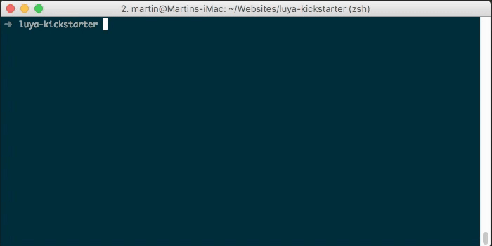

# How to create a CMS block

In this lesson we will show you how to create an image slider block using the LUYA create commands, how to import an existent plugin, add the frontend view code and customize the block to show a preview in the admin view.

Our starting point is a fresh [LUYA kickstarter installation](https://luya.io/guide/install).

## Using the "cms/block/create" command
Creating a block in LUYA is very simple when using our wizards. As [shown in the guides](https://luya.io/guide/app-blocks) the command for creating a new block is:

```
./vendor/bin/luya cms/block/create
```

For our image slider block we will create an app block named ImagesliderBlock" with one `var named **images** and labeled **Images**.
See the GIF below:



This will automatically create an pre filled "ImagesliderBlock.php" in our **blocks** directory and an empty view file with the same name in **views/blocks**

## Register an external Javascript and CSS file

As LUYA is build upon Yii2, we can use the built in asset system. We register external JS files like [shown in the Yii guide](http://www.yiiframework.com/doc-2.0/guide-output-client-scripts.html#script-files) in the beginning of the view file:

```php
<?php 
$this->appView->registerJsFile(
    '//cdn.jsdelivr.net/jquery.slick/1.6.0/slick.min.js', 
    ['depends' => ['\yii\web\JqueryAsset']]
);
?>
```

We are using the open source Javascript slider plugin [slick](http://kenwheeler.github.io/slick/).

Additionally we will add the link to the needed slick CSS files:

```php
$this->appView->registerCssFile('//cdn.jsdelivr.net/jquery.slick/1.6.0/slick.css');
$this->appView->registerCssFile('//cdn.jsdelivr.net/jquery.slick/1.6.0/slick-theme.css');
```

## Init JS plugin and add view code

Finally we initialize the slick plugin:

```php
$this->appView->registerJs("$('.slider').slick({
  infinite: true,
  slidesToShow: 3,
  slidesToScroll: 3
});");
```

The only part which missing is the rendered view code. We want to parse each image from the "var" **images** array and put it into a `div` container and tagging it with the `slider` css class which gets initialized by the plugin. The **images** array will be returned by the `extravars function which was generated by the LUYA code wizard. See the code snippet:

```php
<div style="background-color:#00b0ff; width:100%">
    <div class="slider" style="margin:50px;padding:50px;">
        <? foreach($this->extraValue("images") as $image): ?>
        <div>source ?>" /></div>
        <? endforeach;?>
    </div>
</div>
```

Using a stylesheet is advised also for the sake of a short example, we are using CSS inline code here.

The final frontend view file in `views/blocks/ImagesliderBlock.php` will look like this:

```php
<?php
/**
 * View file for block: ImagesliderBlock 
 *
 * File has been created with `block/create` command on LUYA version 1.0.0. 
 *
 * @param $this->extraValue('images');
 * @param $this->varValue('images');
 *
 * @var $this \luya\cms\base\PhpBlockView
 */

$this->appView->registerJsFile(
    '//cdn.jsdelivr.net/jquery.slick/1.6.0/slick.min.js',
    ['depends' => ['\yii\web\JqueryAsset']]
);

$this->appView->registerCssFile('//cdn.jsdelivr.net/jquery.slick/1.6.0/slick.css');
$this->appView->registerCssFile('//cdn.jsdelivr.net/jquery.slick/1.6.0/slick-theme.css');

$this->appView->registerJs("$('.slider').slick({
  infinite: true,
  slidesToShow: 3,
  slidesToScroll: 3
});");
?>

<div style="background-color:#00b0ff; width:100%">
    <div class="slider" style="margin:50px;padding:50px;">
        <? foreach($this->extraValue("images") as $image): ?>
        <div>source ?>" /></div>
        <? endforeach;?>
    </div>
</div>
```

## Enable image preview in admin view

To be able to see the images of the used image array, we have to provide a view template for LUYA. Besides PHP, it is possible to use [Twig](https://twig.sensiolabs.org/) as a template engine. Similar to our front end output, we want to parse each image of the array but this time we do not use a plugin and show every image side by side. Modify the **admin()** function in ```blocks/ImagesliderBlock.php``` like this:

```php
public function admin()
{
    return
        '<p>ImagesliderBlock</p>
         <div style="margin-left: -15px; margin-top: -15px;" class="clearfix">
                
                    
                
         </div>';
}
```

## Register the new block in LUYA

To be able to use the new block in LUYA, you have to import the `ImagesliderBlock` by running the import command:

```
./vendor/bin/luya import
```

## Using the new block

After reloading the CMS you will notice the new block `ImagesliderBlock` on the right side panel in the `Page Content` view under the `Project block group. Drag it to the stage into the **content** container. You will see an empty block with labeled `ImagesliderBlock`. Click on the block to configure the `vars`, in our case the image array. 

In the GIF below, you will see how to add new images and import pictures into the LUYA filesystem:`


Note the use of the image filter "Thumbnail medium (300xnull)". You can also use a crop filter. This isn't mandatory but it's nice to have evenly sized pictures with a click of a button, instead of resizing all pictures to the exact size before uploading.

After adding some images to the block you can quickly preview the result in the frontend by clicking on the site preview button:


Depending on the configuration of the image slider plugin, the used images and screen size, the frontend output of the plugin will look something like this:


