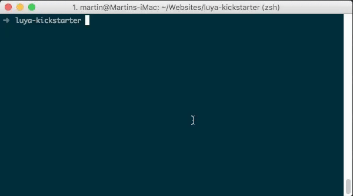
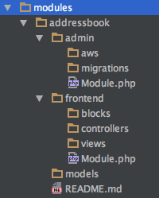
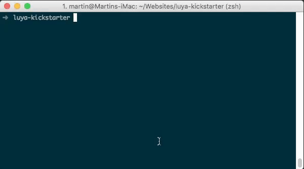
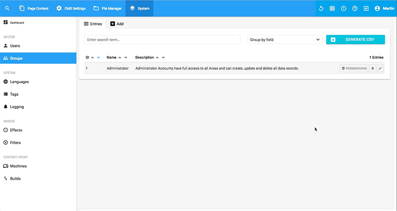

# How to create a LUYA module

In this lesson we're going to create a module which handles all basic needs for maintaining a simple address book. We'll create the module, learn about the CRUD interface, establish an URL route and learning about the two ways of a possible module frontend presentation. 

Our starting point is a fresh [LUYA kickstarter RC3 installation](https://luya.io/guide/install).

## Create the module using the LUYA code wizard

As described in the [LUYA  guide](https://luya.io/guide/app-admin-module) we'll create the module by using the LUYA code wizard:

`./vendor/bin/luya module/create`

See the GIF below:



After successfully executing you'll notice the created file structure in the `modules/addressbook` directory:



## Configure the module

To register the module in LUYA you [have to edit the config file](https://luya.io/guide/app-module) according to your working environment. We'll edit the `configs/env-local.php` because we're developing in the local environment. To register both modules (admin and frontend), we're adding the `addressbook` and `addressbookadmin` module to the existent module section in the config file:

```php
'addressbook' => 'app\modules\addressbook\frontend\Module',
'addressbookadmin' => 'app\modules\addressbook\admin\Module',
``` 

## Creating the models and migrations

Our first step is the creation of our data model and the migration files to create the associated database tables.
Again, we're using the code wizard to [create the migration file](https://luya.io/guide/ngrest-concept) for our registered admin module *addressbookadmin*. We'll need two tables, one for the contact data itself and one for the different contact groups.

```php
./vendor/bin/luya migrate/create addressbook_contact addressbookadmin
./vendor/bin/luya migrate/create addressbook_group addressbookadmin
```

You'll find both migration files in `modules/addressbook/admin/migrations/`.

### Adding migration details

We'll provide a basic data set (first name, last name, etc.) for the contact details and only a name and id for the group table. 

Your migration file should look like this:

```php
<?php

use yii\db\Migration;

class m170509_135035_addressbook_basetables extends Migration
{
    public function safeUp()
    {
        $this->createTable('addressbook_contact', [
            'id' => $this->primaryKey(),
            'group_id' => $this->integer()->notNull(),
            'salutation' => $this->string(),
            'firstname' => $this->string()->notNull(),
            'lastname' => $this->string()->notNull(),
            'street' => $this->string(),
            'zip' => $this->string(100),
            'city' => $this->string(),
            'country' => $this->string(),
            'email' => $this->string(),
            'notes' => $this->text(),
        ]);

        $this->createTable('addressbook_group', [
            'id' => $this->primaryKey(),
            'name' => $this->string()->notNull(),
        ]);
    }

    public function safeDown()
    {
        $this->dropTable('addressbook_contact');
        $this->dropTable('addressbook_group');
    }
}
```

Note that your migration class name will differ because of the included timestamp.

### Executing the migrations

To create the database tables from the migration files, you've to execute the `migrate` command:

`./vendor/bin/luya migrate`

### Creating the models

Again we're using the LUYA code wizard to help us create the corresponding models with a preconfigured CRUD view for the database tables:

`./vendor/bin/luya crud/create`

Below you see how to use the wizard to automatically create the contact model`models/Contact.php` and all associated files like the API controller `modules/addressbook/admin/apis/ContactController.php` and the controller `modules/addressbook/admin/controllers/ContactController.php`:



Repeat the process for the `Group` model.

## Adding the module to the admin menue

In order to see the new module, you've to define the menue appearance in the `modules/addressbook/admin/Module.php`. After succesfully executing the `crud/create` command you'll also get a generated code proposal (green color) in the command line (see the GIF above). We want to see both the contacts and the groups in the admin menue and have to modify the generated code accordingly.

Your admin `Module.php` should look like this:

```php
<?php

namespace app\modules\addressbook\admin;

/**
 * Addressbook Admin Module.
 *
 * File has been created with `module/create` command on LUYA version 1.0.0-RC3. 
 */
class Module extends \luya\admin\base\Module
{
    public $apis = [
        'api-addressbook-contact' => 'app\modules\addressbook\admin\apis\ContactController',
    ];

    public function getMenu()
    {
        return (new \luya\admin\components\AdminMenuBuilder($this))
            ->node('Contact', 'extension')
            ->group('Group')
            ->itemApi('Contact', 'addressbookadmin/contact/index', 'label', 'api-addressbook-contact');
    }
}
```

## Importing the module

Finally, we're going to import the new modules with the import command:

`./vendor/bin/luya import`

Before we'll see the module in the admin view, we've to set the permissions for the `addressbookadmin` for our user in `System/Groups/Permissions`:



## Linking the group table in the contact table

We don't want to put the group id in a contact record. In order to get a nice dropdown with all available `Groups`, we've to modify the `ngRestAttributeTypes()` function in the `Contact.php` model. We'll use the [selectModel](https://luya.io/guide/ngrest-plugin-select) attribute type for the field `group_id`. 

Our `ngRestAttributeTypes()` function should look like this:

```php
public function ngRestAttributeTypes()
    {
        return [
            'group_id' => [
                    'selectModel',
                    'modelClass' => Group::className(),
                    'valueField' => 'id',
                    'labelField' => 'name'
                ],
            'salutation' => 'text',
            'firstname' => 'text',
            'lastname' => 'text',
            'street' => 'text',
            'zip' => 'text',
            'city' => 'text',
            'country' => 'text',
            'email' => 'text',
            'notes' => 'textarea',
        ];
    }
```

Now add a new contact record in the admin panel under `Addressbook/Contact/Add` and notice the dropdown under the label `Group ID`. Don't forget to create some test groups before. 
Change the labels in the `attributeLabels()` function to your liking.

## Frontend presentation

After adding some sample data it's time to add a presentation of our module to the frontend. To do this we'll have two options: using a [frontend module](https://luya.io/guide/app-module-frontend) or using the module block.

### Module block 

If you're using the module block to render the frontend module, you can place other blocks above and below because you're in the CMS context. This is most useful for simple modules which have only one view (i.e. a simple form). If you're linking a detail view inside the module view, you won't leave the page and the detail view will get rendered in the same block. Another disadvantage is the static URL to the page. No matter what you're doing in the module block view, the site URL won't change as you're still in the context of the CMS page where you've placed the module block.

### Frontend module

Using a Frontend Module offer all possibilities: you can define your own layout, you've full control of the URL routes and you're able to control all aspects of the page not just a part of it (from setting the page title tag to defining all detail views). 

## Set up the frontend module

We're choosing the frontend module path because we want full control over site and we want to define two views, a list and a detail view.

### Setting up the DefaultController

First we want the functionality of a list view of all contacts. We're using an [active data provider](http://www.yiiframework.com/doc-2.0/guide-output-data-providers.html) for this task. After configure our desired page size and sort order, we're rendering the *index* view and assign our active data provider.

We also want a detail view of a selected contact. For this we're defining another action function: *actionDetail*. This time we're querying the selected record and render the *detail* view.

```php
<?php

namespace app\modules\addressbook\frontend\controllers;

use app\modules\addressbook\models\Contact;
use luya\web\Controller;
use yii\data\ActiveDataProvider;

class DefaultController extends Controller
{
    public function actionIndex()
    {
        $provider = new ActiveDataProvider([
            'query' => Contact::find(),
            'pagination' => [
                'pageSize' => 20,
            ],
            'sort' => [
                'defaultOrder' => [
                    'group_id' => SORT_ASC,
                    'lastname' => SORT_ASC,
                ]
            ],
        ]);

        return $this->render('index', [
            'provider' => $provider
        ]);
    }
    
    public function actionDetail($id = null)
    {
        if ($id) {
            $model = Contact::findOne($id);
        } else {
            $model = Contact::findOne(1);
        }

        return $this->render('detail', [
            'model' => $model
        ]);
    }
}
```

### Setting up the index view

We create the `index.php` and define a [Yii 2 grid view](http://www.yiiframework.com/doc-2.0/yii-grid-gridview.html). We pass over our *$dataprovider* which was defined in our *DefaultController* above. We give some styling options and more importantly we define custom row options as we want to be able to click on a table entry. We define *location.href* change for the *onclick* event and some background color changes when hovering with the mouse cursor. This is how it looks in the end:

```php
<?= \yii\grid\GridView::widget([
    'dataProvider' => $provider,
    'columns' => ['firstname', 'lastname', 'country'],
    'rowOptions' => function ($model, $key, $index, $grid) {
        $route = \luya\helpers\Url::toRoute(['/addressbook/default/detail', 'id' => $key]);
        return [
            'id' => $model['id'],
            'style' => 'cursor:pointer;background-color:#fff',
            'onclick' => 'location.href="'.$route.'";',
            'onmouseover' => '$("tbody > tr").css("background-color","#fff");$(this).css("background-color","rgb(211, 236, 255)");'
        ];
    },
    'tableOptions' => ['class' => 'table table-bordered']

]); ?>
```

Again you should work with style sheets and external javscript files, but for the sake of a short example we'll define everything inline.

### Setting up the detail view

When clicking on an entry in the list view, we'll get routed to our detail view. To be able to get back fast, we're creating a back button with the correct URL route to our list view. Our detail view uses a Yii widget again: the [DetailView](http://www.yiiframework.com/doc-2.0/yii-widgets-detailview.html) widget.

```php
<div>
    <a href="<?= $route = \luya\helpers\Url::toRoute(['/addressbook']); ?>">< Back</a>
</div>
<br/>

<?= \yii\widgets\DetailView::widget([
    'model' => $model,
    'attributes' => [
        'salutation',
        'firstname',
        'lastname',
        'street',
        'notes:html',
    ],
]);
```
