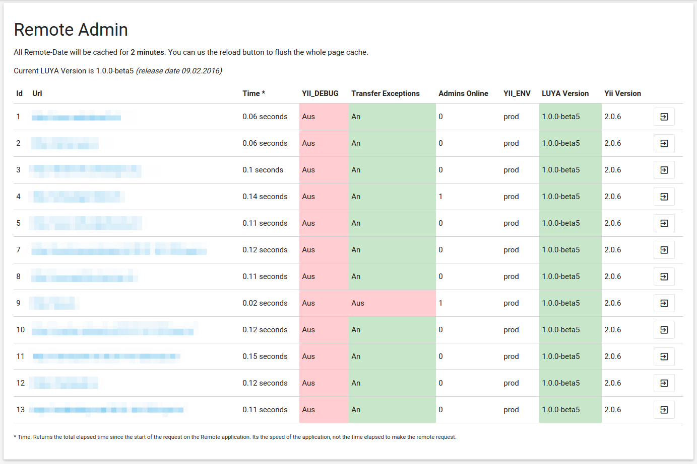

REMOTE ADMIN
=============

**The powerful tool for Agencies!**

*What is REMOTE ADMIN?* Well, have you ever created several websites with the same system and delivered them to different Providers? Remote Admin provides you the ability to collect all your LUYA Websites into the REMOTE ADMIN and helps you to see:

+ Which websites are outdated? (compare LUYA version to the current LUYA version inside packagist)
+ Returns informatiions about the Website itself, to make sure they are configured well.
+ See how many administration users are Online.
+ Direct Link to the Webseite.

We will add more features in future, to make the LUYA control panel a powerfull tool!



How to
------

Remote Admin will work out of the box with all LUYA instances you create, just add a `remoteToken` in your project application config and install the remoteadmin module on your privat/company Server/Website and you are able to add all instances.

### Your LUYA Website Cockpit instance

require remoteadmin in composer.json:

```
"zephir/luya-module-remoteadmin" : "1.0.0-beta5",
```

add remote admin to the list of your modules:

```
'remoteadmin' => [
    'class' => 'remoteadmin\Module'
],
```

> Remoteadmin requires the LUYA Admin module

Login into your admin interface and your are ready to add LUYA instances.


### Instance Setup

add a remote token to the application you want to control:

```
'remoteToken' => 'ADD_YOUR_SECRET_STRONG_TOKEN_HERE',
```

> Use http://passwordsgenerator.net to generate a strong token

Now you are able to add this instance to your remote admin with the above added remoteToken.